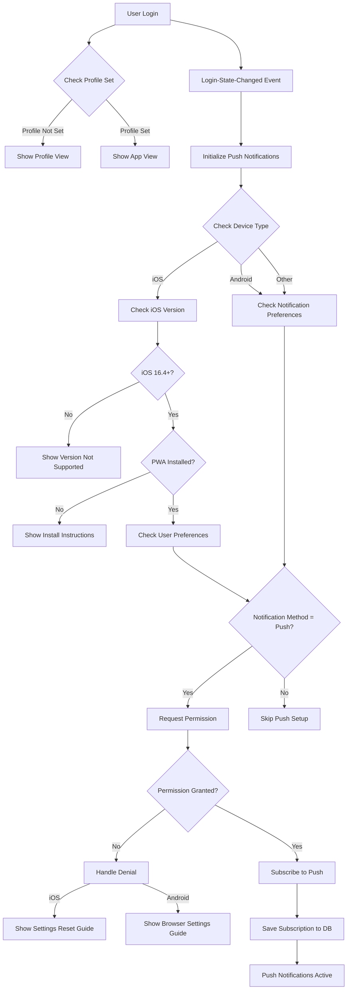
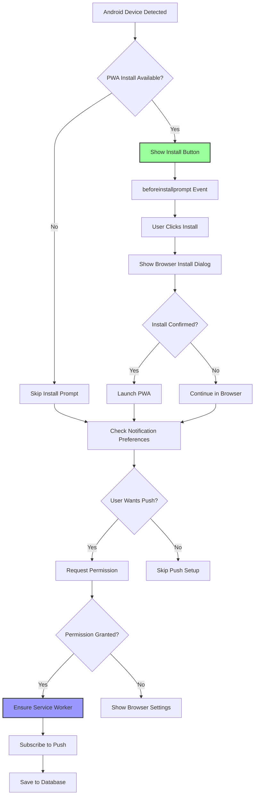
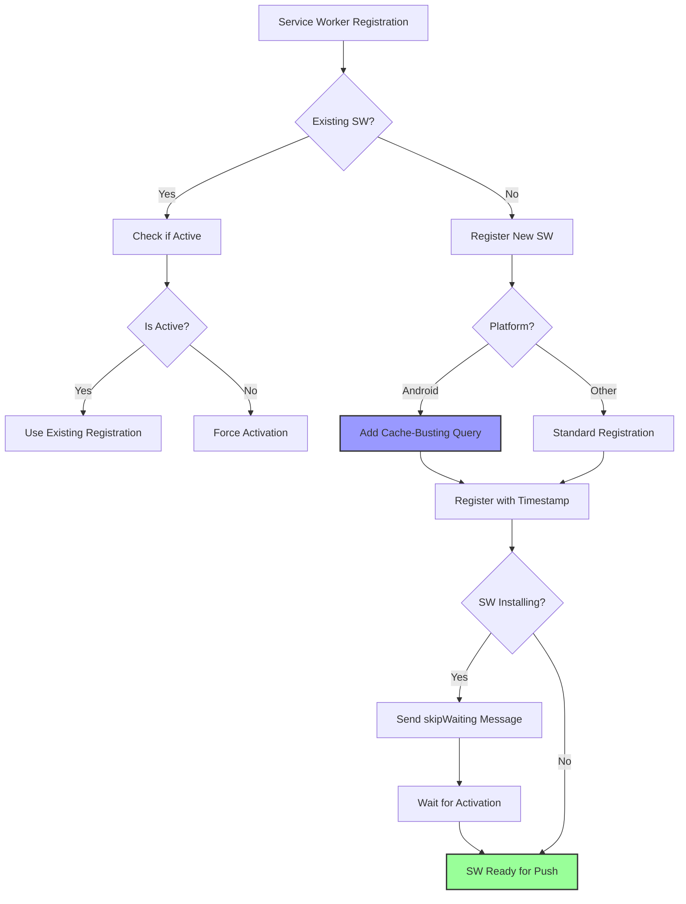
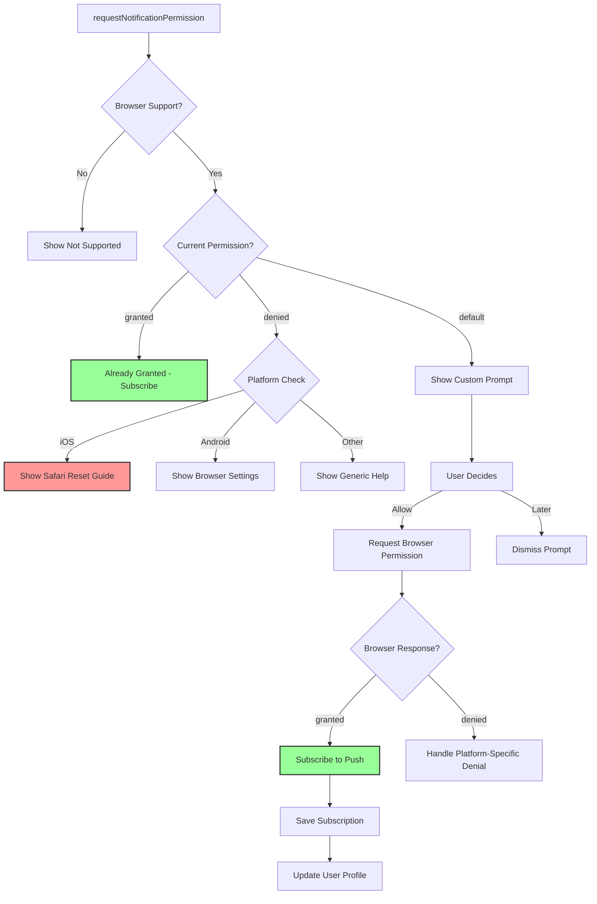
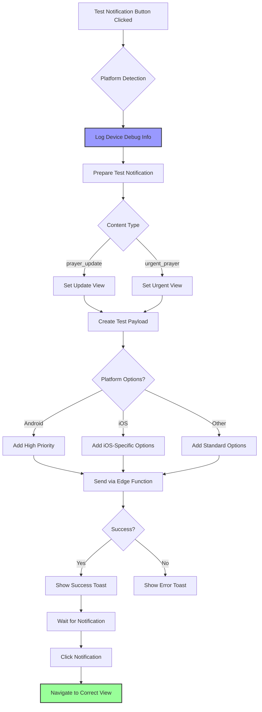
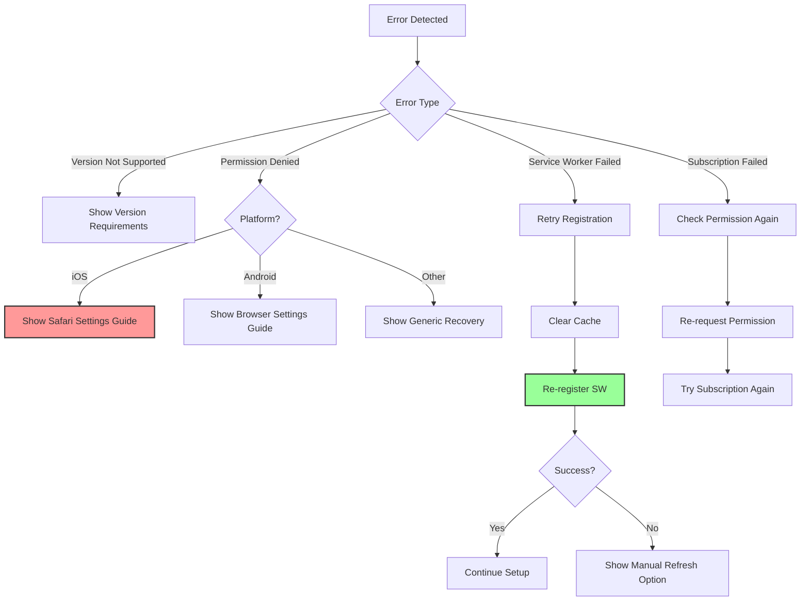

# Push Notification Permission Flow Diagram

## Overall Flow Diagram



## iOS Specific Flow

```mermaid
flowchart TD
    A[iOS Device Detected] --> B{Check iOS Version}
    B --> C{Version >= 16.4?}
    C -->|No| D[Show "iOS 16.4+ Required"]
    C -->|Yes| E{PWA Installed?}
    
    E -->|No| F[Show PWA Install Guide]
    F --> G[User Must Install Manually]
    G --> H[Safari Share Menu]
    H --> I[Add to Home Screen]
    I --> J[Launch from Home Screen]
    J --> K[Retry Notification Setup]
    
    E -->|Yes| L{Check Permission}
    L --> M{Previously Denied?}
    M -->|Yes| N[Show Safari Settings Reset]
    M -->|No| O[Request Permission]
    O --> P{Granted?}
    P -->|Yes| Q[Subscribe to Push]
    P -->|No| R[Ask Later or Denied]
    
    style F fill:#f9f,stroke:#333,stroke-width:2px
    style N fill:#f99,stroke:#333,stroke-width:2px
```

## Android Specific Flow



## User Profile Integration Flow

```mermaid
flowchart TD
    A[User Visits Profile Page] --> B[Load Profile Settings]
    B --> C[Show Notification Options]
    C --> D{User Selects "Yes" for Notifications}
    
    D -->|No| E[Hide Notification Options]
    D -->|Yes| F{Platform Check}
    
    F -->|iOS Non-PWA| G[Revert Selection]
    G --> H[Show PWA Install Guide]
    
    F -->|iOS PWA or Android| I[Request Permission Immediately]
    I --> J{Permission Granted?}
    
    J -->|Yes| K[Show Test Panel]
    K --> L[Enable Test Button]
    
    J -->|No| M[Revert Selection]
    M --> N[Show Permission Help]
    
    style G fill:#f99,stroke:#333,stroke-width:2px
    style K fill:#9f9,stroke:#333,stroke-width:2px
```

## Service Worker Registration Flow



## Permission Request Flow



## Testing Flow



## Key Platform Differences Summary

| Feature | iOS | Android | Other Browsers |
|---------|-----|---------|----------------|
| **Minimum Version** | iOS 16.4+ | Most modern versions | Modern browsers |
| **PWA Requirement** | Must be installed | Optional (recommended) | Optional |
| **Installation Method** | Manual via Safari | Automatic prompt | Browser-dependent |
| **Permission Reset** | Safari → Settings → Advanced → Website Data | Browser/System Settings | Browser Settings |
| **Service Worker** | Standard registration | Cache-busting registration | Standard registration |
| **Notification Options** | Basic options | Full options with priority | Standard options |
| **Error Handling** | iOS-specific guides | Android-specific guides | Generic guides |

## Error States and Recovery



This comprehensive flow diagram shows how the notification permission system handles different devices, platforms, and error states while maintaining a smooth user experience across iOS and Android devices.
